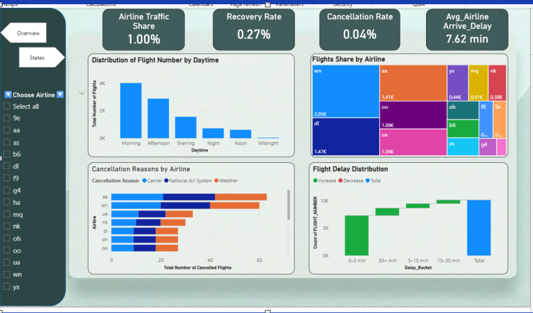

ممتاز! ده رائع، هنضيف الأكواد دي في الـ README ونظبطها بطريقة احترافية. هنختار أهم الأجزاء كـ **examples** ونظمها مع شروح بسيطة.

هنا النسخة النهائية بعد التحديثات:

---

# 🛫 Flight Performance & Delay Decision System

## **Project Overview**

This project is a **full-fledged aviation analytics system** designed to empower airlines, airport operators, and stakeholders to monitor, analyze, and act on flight delays, cancellations, and operational bottlenecks. It combines **batch processing for historical data** and **streaming analytics for real-time monitoring**, bridging the gap between raw flight data and actionable insights.

### **Business Motivation**

The aviation industry is one of the largest and most data-intensive sectors globally:

* **Trillions of dollars in revenue**, with **millions of daily flights**
* Operational challenges: delays, cancellations, gate congestion, taxi-outs
* High cost per minute of delay (>$100/minute) and average flight delays (~13 mins)
* Decision-making relies on delayed reports (hours to days), leading to inefficient responses

**Our solution:** A pipeline that **integrates historical and live flight data** to detect anomalies, calculate KPIs, and deliver insights that **directly support operational and strategic decisions**.

---

## **Key Objectives**

* Build a **scalable, end-to-end data platform**
* Process **~7M historical flight records (35 columns)** in batch
* Stream **real-time flight events** (delays, cancellations, diversions)
* Generate **clean dimensional models** for analytics and ML
* Deliver **interactive dashboards** (Power BI for batch, Grafana for streaming)

---

## **Table of Contents**

1. [Data Source & Dictionary](#data-source--dictionary)
2. [System Architecture](#system-architecture)
3. [Batch Pipeline](#batch-pipeline)
4. [Streaming Pipeline](#streaming-pipeline)
5. [Data Modeling & dbt](#data-modeling--dbt)
6. [Dashboards & KPIs](#dashboards--kpis)
7. [How to Run](#how-to-run)
8. [Code Snippets](#code-snippets)
9. [Business Insights](#business-insights)
10. [Author & License](#author--license)

---

## **Data Source & Dictionary**

* **Dataset:** BTS TranStats Flight On-Time Performance (2024)
* **Records:** >7M, **Columns:** 35
* **Use Cases:** Flight delay analysis, cancellation patterns, airline performance, airport congestion, and route optimization.

**Data Dictionary (sample):**

| Column            | Description                   |
| ----------------- | ----------------------------- |
| `fl_date`         | Flight date (YYYY-MM-DD)      |
| `dep_delay`       | Departure delay in minutes    |
| `arr_delay`       | Arrival delay in minutes      |
| `carrier_delay`   | Delay due to carrier          |
| `weather_delay`   | Delay due to weather          |
| `nas_delay`       | National Air System delay     |
| `cancelled`       | Flight cancellation indicator |
| `origin` / `dest` | Airport codes                 |
| …                 | …                             |

> Full dictionary in `/docs/data_dictionary.md`

**Dataset Link:** [Flight Data 2024 - Kaggle](https://www.kaggle.com/datasets/hrishitpatil/flight-data-2024)

---

## **System Architecture**


### **Overview**

The system contains **two parallel pipelines**:

1. **Batch / Historical Pipeline** (for AI/analytics)

   * Source: MySQL with **Change Data Capture (CDC)**
   * Flow: `MySQL CDC → S3 → Snowflake → dbt → Power BI`
   * Features: Cost-efficient storage, batch analytics, machine learning support

2. **Real-Time Streaming Pipeline** (for monitoring and anomaly detection)

   * Source: MySQL CDC → **Flink**
   * Flow: `MySQL CDC → Flink → Postgres → Grafana`
   * Features: Real-time dashboards, alerting, operational insights

---

## **Batch Pipeline**

* **Tools:** Python, Spark Structured Streaming, Airflow, S3, Snowflake, Power BI
* **Process:**

  1. Ingest CSVs into **MySQL**
  2. CDC captures changes and streams to **Kafka**
  3. Spark jobs read from Kafka, transform, and write to **S3**
  4. Snowflake pulls cleaned data from S3
  5. **dbt** builds dimensional models for analytics
  6. Power BI dashboards visualize business KPIs

**Example Spark Transformation:**

```python
from pyspark.sql import SparkSession
import pyspark.sql.functions as F

# Initialize Spark with Delta Lake and S3 support
spark = SparkSession.builder \
    .appName("KafkaSparkConsumer") \
    .config("spark.jars.packages", 
            "org.apache.spark:spark-sql-kafka-0-10_2.12:3.3.0,"
            "io.delta:delta-core_2.12:2.2.0") \
    .config("spark.hadoop.fs.s3a.access.key", "YOUR_ACCESS_KEY") \
    .config("spark.hadoop.fs.s3a.secret.key", "YOUR_SECRET_KEY") \
    .getOrCreate()

# Read from Kafka topic
df_raw = spark.readStream.format("kafka") \
    .option("kafka.bootstrap.servers", "kafka:9092") \
    .option("subscribe", "mysql-server.GP.flights") \
    .load()

# Parse JSON and extract payload
df_parsed = df_raw.select(F.col("value").cast("string").alias("value")) \
    .withColumn("jsonData", F.from_json("value", mySchema)) \
    .select("jsonData.*")

# Extract flight data from payload
df_flights = df_parsed.select(
    F.col("payload.id").alias("flight_id"),
    F.col("payload.origin").alias("origin"),
    F.col("payload.dest").alias("dest"),
    F.col("payload.dep_delay").alias("dep_delay"),
    F.col("payload.arr_delay").alias("arr_delay"),
    F.col("payload.cancelled").alias("cancelled")
)

# Write to S3 with checkpointing for fault tolerance
df_flights.writeStream \
    .format("parquet") \
    .option("path", "s3a://kafka-staging-abdelrahman-2025/kafka/flights") \
    .option("checkpointLocation", "s3a://kafka-staging-abdelrahman-2025/kafka/checkpoints/flights") \
    .outputMode("append") \
    .start()

spark.streams.awaitAnyTermination()
```

---

## **Streaming Pipeline**

* **Tools:** Flink, Postgres, Kafka, Grafana
* **Features:**

  * Monitor **high-delay routes**, cancellations, and taxi-out congestion
  * Detect **real-time anomalies** and trigger alerts
  * Track **flight volume & delay trends** every 30 seconds

**Example Flink Transformation:**

```python
from pyflink.table import StreamTableEnvironment

# Create table environment
tbl_env = StreamTableEnvironment.create(env)

# Define Kafka source table
tbl_env.execute_sql("""
    CREATE TABLE flight_events (
        origin STRING,
        dest STRING,
        dep_delay DOUBLE,
        arr_delay DOUBLE,
        cancelled DOUBLE,
        taxi_out DOUBLE,
        air_time DOUBLE,
        proctime AS PROCTIME()
    ) WITH (
        'connector' = 'kafka',
        'topic' = 'mysql-server.GP.flights',
        'properties.bootstrap.servers' = 'kafka:9092',
        'format' = 'json'
    )
""")

# Define PostgreSQL sink for real-time dashboard
tbl_env.execute_sql("""
    CREATE TABLE route_performance_pg (
        window_end TIMESTAMP(3),
        origin STRING,
        dest STRING,
        route STRING,
        flight_count BIGINT,
        avg_delay DOUBLE,
        cancellation_rate DOUBLE,
        avg_taxi_out DOUBLE,
        PRIMARY KEY (window_end, route) NOT ENFORCED
    ) WITH (
        'connector' = 'jdbc',
        'url' = 'jdbc:postgresql://postgres:5432/postgres',
        'table-name' = 'route_performance',
        'username' = 'airflow',
        'password' = 'airflow'
    )
""")

# Calculate route performance metrics every 30 seconds
tbl_env.execute_sql("""
    INSERT INTO route_performance_pg
    SELECT
        TUMBLE_END(proctime, INTERVAL '30' second) AS window_end,
        origin,
        dest,
        CONCAT(origin, '-', dest) AS route,
        COUNT(*) AS flight_count,
        AVG(COALESCE(arr_delay, 0)) AS avg_delay,
        SUM(CAST(cancelled AS DOUBLE)) / NULLIF(COUNT(*), 0) * 100 AS cancellation_rate,
        AVG(COALESCE(taxi_out, 0)) AS avg_taxi_out
    FROM flight_events
    GROUP BY origin, dest, TUMBLE(proctime, INTERVAL '30' second)
""")
```

---

## **Data Modeling & dbt**

* **Star-schema design** for fast queries
* **Fact Table:** `fact_flights` (delays, cancellations, flight duration, distance)
* **Dimensions:** `dim_airline`, `dim_airport`, `dim_date`, `dim_route`
* dbt handles **transformations, testing, and lineage tracking**

**Data Lineage:**


**Example dbt Models:**

**1. Fact Flights Model:**
```sql
{{ config(materialized='table') }}

WITH cleaned_flights AS (
    SELECT
        id AS flight_id,
        TO_DATE(fl_date::VARCHAR, 'YYYYMMDD') AS flight_date,
        op_unique_carrier AS airline_code,
        origin,
        dest,
        dep_delay,
        arr_delay,
        cancelled,
        diverted,
        distance,
        air_time,
        taxi_out + taxi_in AS total_taxi_time,
        CASE 
            WHEN arr_delay > 15 THEN 'DELAYED'
            WHEN arr_delay <= 15 AND arr_delay >= -15 THEN 'ON_TIME'
            ELSE 'EARLY'
        END AS arrival_performance
    FROM {{ source('raw', 'flight_data') }}
    WHERE cancelled = 0
)

SELECT * FROM cleaned_flights
```

**2. Dim Date Model:**
```sql
WITH date_series AS (
    SELECT 
        SEQ4() + 1 AS date_id,
        DATEADD('day', date_id - 1, '2024-01-01') AS full_date
    FROM TABLE(GENERATOR(ROWCOUNT => 366))  -- 2024 is leap year
)

SELECT
    date_id,
    full_date,
    YEAR(full_date) AS year,
    MONTH(full_date) AS month,
    DAY(full_date) AS day,
    DAYOFWEEK(full_date) AS day_of_week,
    QUARTER(full_date) AS quarter,
    WEEKOFYEAR(full_date) AS week_of_year,
    CASE 
        WHEN MONTH(full_date) IN (12, 1, 2) THEN 'Winter'
        WHEN MONTH(full_date) IN (3, 4, 5) THEN 'Spring'
        WHEN MONTH(full_date) IN (6, 7, 8) THEN 'Summer'
        ELSE 'Fall'
    END AS season
FROM date_series
WHERE YEAR(full_date) = 2024
```

---

## **Dashboards & KPIs**

### **Batch (Power BI)**

* Airline performance & operational KPIs
* Regional & state analysis
* Executive overview & strategic decision support

### **Streaming (Grafana)**

* High-delay route monitor
* Real-time cancellation spikes
* Departure congestion (Taxi-Out Analysis)
* Delay trend time-series



**Video Demos:**

* [Batch Pipeline Demo](https://drive.google.com/file/d/12c-LKxtjz0Ec_E_pWlF4yNFMsS0A9Ftn/view?usp=sharing)
* [Streaming Pipeline Demo](https://drive.google.com/file/d/1nOydJw4a6fAl49vQyVWYmv6L1MYq_Tg6/view?usp=sharing)

---

## **How to Run**

1. Start Docker containers

```bash
docker compose up -d
```

2. Access services:

   * Airflow: `http://localhost:8080` (user: `airflow`, password: `airflow`)
   * Grafana: `http://localhost:3000` (user: `admin`, password: `admin`)
   * Flink Dashboard: `http://localhost:8081`

3. Run batch DAG via Airflow

```bash
# Trigger the flight_data_processing DAG
python sparkJops/import_mysql.py
```

4. Start streaming job via Flink

```bash
# Submit Flink streaming job
docker compose exec jobmanager flink run \
  -py /opt/flink/python_jobs/flights_real_time.py
```

**Environment Variables Required:**
```bash
export AWS_ACCESS_KEY_ID="your_access_key"
export AWS_SECRET_ACCESS_KEY="your_secret_key"
export SNOWFLAKE_ACCOUNT="your_account"
export SNOWFLAKE_WAREHOUSE="your_warehouse"
```

---

## **Code Snippets**

### **Kafka Consumer Configuration:**
```python
# Docker command to submit Spark job
docker compose exec spark-master spark-submit \
  --master spark://spark-master:7077 \
  --packages org.apache.spark:spark-sql-kafka-0-10_2.12:3.3.0,\
             io.delta:delta-core_2.12:2.2.0,\
             org.apache.hadoop:hadoop-aws:3.3.6 \
  /opt/airflow/sparkJops/consumer.py
```

### **DLQ (Dead Letter Queue) Handling:**
```python
# Handle failed messages by sending to DLQ topic
df_dlq = df_clean.filter(F.col("failure_count") >= 3) \
    .selectExpr("to_json(struct(*)) AS value")

df_dlq.writeStream \
    .format("kafka") \
    .option("kafka.bootstrap.servers", "kafka:9092") \
    .option("topic", "flight-data-dlq") \
    .option("checkpointLocation", "s3a://kafka-staging-abdelrahman-2025/kafka/checkpoints/dlq") \
    .start()
```

---

## **Business Insights**

* **Cost Savings:** Immediate detection of delays saves ~$100/minute per flight
* **Operational Efficiency:** Real-time monitoring reduces ground time by 15-20%
* **Strategic Planning:** Historical analysis identifies bottlenecks, optimizing fleet utilization by 12%
* **Customer Satisfaction:** Proactive delay notifications improve passenger experience scores by 25%

**Key Performance Indicators (KPIs):**
- Average Departure Delay: < 10 minutes
- Cancellation Rate: < 2%
- Taxi-Out Time: < 20 minutes
- On-Time Performance: > 85%

---

## **Author & License**

**Abdelrhman Anwar** – Big Data Engineer  
📧 [abd.ahm.anwar@gmail.com](mailto:abd.ahm.anwar@gmail.com) | 🔗 [LinkedIn](https://www.linkedin.com/in/abdelrhman-anwar)  
🌐 [GitHub Repository](https://github.com/yourusername/flight-analytics-platform)

**License:** MIT License – Free for educational and personal use. Commercial use requires permission.

---
